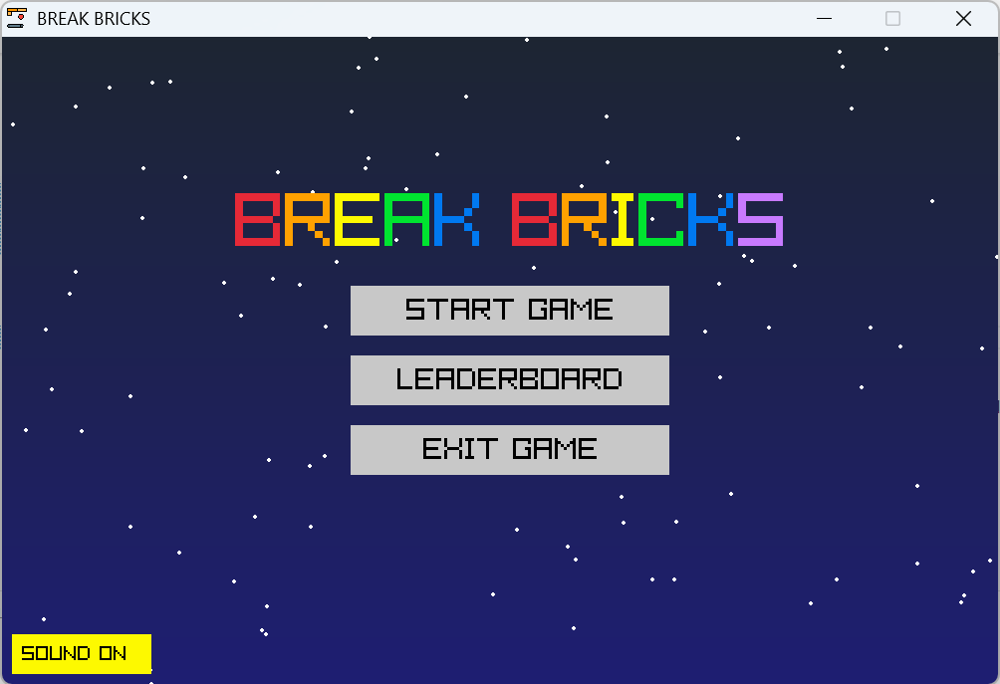

# Break Bricks

## 📌 Deskripsi
**Break Bricks** adalah game retro yang terinspirasi dari permainan klasik **Breakout**. Pemain mengendalikan **paddle** untuk memantulkan bola dan menghancurkan semua **blok** di layar. Game ini dikembangkan menggunakan **Raylib** dengan bahasa pemrograman **C** sebagai bagian dari **Tugas Proyek 2 - Pengembangan Aplikasi Berbasis Library** di **Jurusan Teknik Komputer dan Informatika, POLBAN**.

## 👥 Anggota Kelompok (C6)
- **Wyandhanu Maulidan Nugraha** (241511092)
- **Siti Soviyyah** (241511090)
- **Nezya Zulfa Fauziah** (241511085)
- **Muhammad Raihan Abubakar** (241511084)
- **Muhammad Brata Hadinata** (241511082)
- **Ahmad Habib Mutaqqin** (241511065)

### 📌 Dosen Pembimbing/Manager: **Djoko Cahyo Utomo**

## 🎮 Fitur Game
✅ **Gameplay Klasik** - Konsep **Breakout** dengan paddle dan bola untuk menghancurkan blok.
✅ **Level Beragam** - Berbagai pola blok dengan tingkat kesulitan yang meningkat.
✅ **Fisik Realistis** - Pantulan bola mengikuti hukum fisika sederhana.
✅ **Grafik Simpel & Menarik** - Menggunakan **Raylib** untuk tampilan 2D yang ringan.
✅ **Kontrol Mudah** - Gerakan paddle dengan keyboard untuk pengalaman bermain yang nyaman.
✅ **Efek Suara** - Menambah keseruan dengan efek suara saat memantulkan bola dan menghancurkan blok.

## 🕹️ Cara Bermain
1. **Jalankan Game**: Buka aplikasi **Break Bricks**.
2. **Gunakan Keyboard**:
   - **← (Left Arrow)**: Geser paddle ke kiri.
   - **→ (Right Arrow)**: Geser paddle ke kanan.
   - **Spasi**: Mulai permainan.
3. **Tujuan**: Hancurkan semua blok menggunakan bola tanpa membiarkannya jatuh.
4. **Game Over**: Jika bola jatuh dari layar, permainan berakhir.

## 🛠️ Teknologi yang Digunakan
- **Bahasa Pemrograman**: C
- **Library**: Raylib

## 📥 Instalasi & Cara Menjalankan
### 1️⃣ Clone Repository
```bash
git clone https://github.com/wyandhanupapoy/Break-Bricks.git
cd Break-Bricks
```

### 2️⃣ Install Raylib (Jika Belum Ada)
```bash
sudo apt install libraylib-dev   # Untuk Linux
choco install raylib             # Untuk Windows (via Chocolatey)
brew install raylib              # Untuk macOS (via Homebrew)
```

### 3️⃣ Compile & Jalankan
```bash
gcc main.c paddle.c block.c BOLA.c nyawa.c skor.c stopwatch.c leaderboard.c mainmenu.c level.c layout.c background.c sound.c -o my_game -lraylib -lm -lpthread
./breakbricks
```

## 📷 Cuplikan Layar


## 📜 Lisensi
Proyek ini dibuat untuk tujuan akademik dalam mata kuliah **Pengembangan Aplikasi Berbasis Library** di POLBAN.

---
📌 **Repository GitHub**: [Break Bricks](https://github.com/wyandhanupapoy/Break-Bricks)

