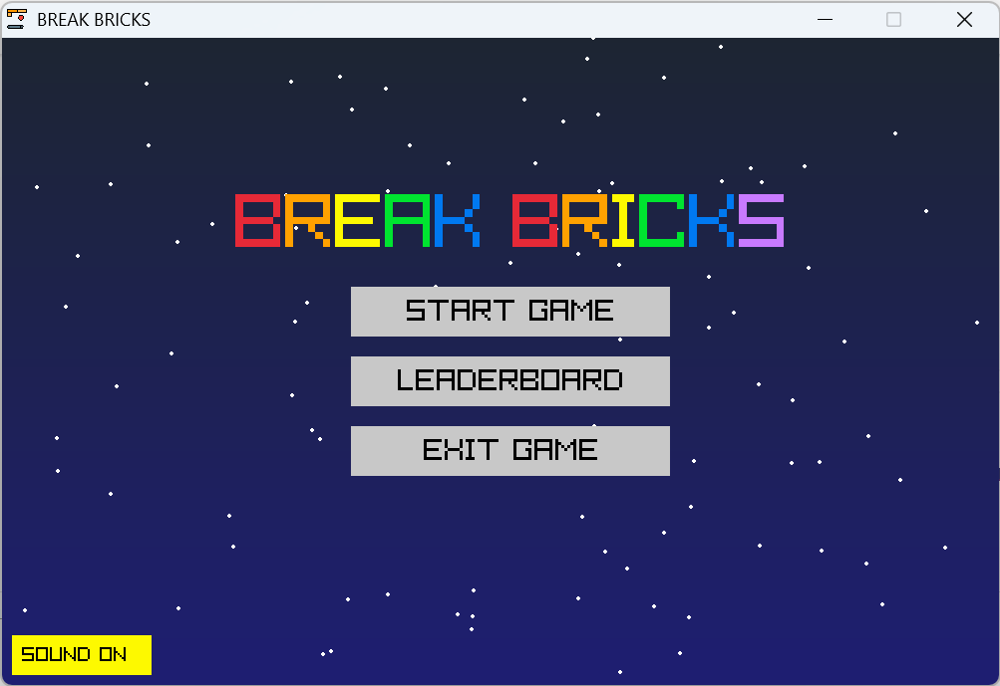

# Break Bricks

## 📌 Deskripsi
**Break Bricks** adalah game retro yang terinspirasi dari permainan klasik **Breakout**. Pemain mengendalikan **paddle** untuk memantulkan bola dan menghancurkan semua **blok** di layar. Game ini dikembangkan menggunakan **Raylib** dengan bahasa pemrograman **C** sebagai bagian dari **Tugas Proyek 2 - Pengembangan Aplikasi Berbasis Library** di **Jurusan Teknik Komputer dan Informatika, POLBAN**.

## 👥 Anggota Kelompok (C6)
- **Wyandhanu Maulidan Nugraha** (241511092) wyandhanupapoy
- **Siti Soviyyah** (241511090) nsitizen
- **Nezya Zulfa Fauziah** (241511085) nezyazulfa
- **Muhammad Raihan Abubakar** (241511084) hanzz78
- **Muhammad Brata Hadinata** (241511082) MuhammadBrataH
- **Ahmad Habib Mutaqqin** (241511065)

### 📌 Dosen Pembimbing/Manager: **Djoko Cahyo Utomo**

## 🎮 Fitur Game
✨ **Gameplay Klasik Breakout yang Disempurnakan**: Nikmati esensi game Breakout dengan paddle, bola, dan blok yang harus dihancurkan.

🔼 **Beragam Level & Kesulitan**: Pilih dari level Easy, Medium, atau Hard, masing-masing dengan konfigurasi blok dan tantangan yang berbeda (blok multi-hit).

🚀 **Sistem Power-Up Dinamis**: Kumpulkan power-up seperti **Bola Ganda (Triple Ball)** dan **Paddle Panjang** untuk membantumu menghancurkan blok lebih cepat.

🏆 **Leaderboard Interaktif**: Catat skormu! Leaderboard menyimpan nama pemain, skor, waktu bermain, level tercapai, dan status akhir (Menang/Kalah). Peringkat teratas akan mendapatkan medali emas, perak, atau perunggu.

🎨 **Menu Utama yang Kaya Fitur**: Navigasi yang mudah melalui menu utama, pemilihan level, tampilan leaderboard (dengan scroll), pengaturan suara (volume & mute), dan halaman informasi tim pengembang.

👤 **Input Nama Pemain**: Personalisasikan entri leaderboard-mu dengan nama pemain (hingga 8 karakter).

🔊 **Kontrol Audio Lengkap**: Atur volume musik dan efek suara secara terpisah melalui menu pengaturan atau tombol cepat. Opsi Mute/Unmute tersedia. Musik latar yang berbeda untuk menu dan gameplay.

🌌 **Latar Belakang Animasi & Efek Visual**: Latar belakang dengan gradasi warna yang berubah secara dinamis dan efek bintang jatuh yang menawan. Terdapat juga animasi latar yang berbeda untuk setiap level.

📊 **Panel Informasi Terperinci**: Pantau progresmu dengan panel di sisi kanan yang menampilkan Skor, Sisa Nyawa (dengan ikon hati), Waktu Bermain, dan durasi Power-up aktif.

🧱 **Blok Multi-Hit**: Beberapa blok memerlukan lebih dari satu pukulan untuk hancur, ditandai dengan perubahan warna.

⚾ **Fisika Bola yang Realistis**: Pantulan bola yang responsif dan dapat diprediksi, dengan kecepatan minimum dan maksimum.

❤️ **Sistem Nyawa**: Hati-hati jangan sampai bola terakhirmu jatuh! Kehilangan nyawa akan mereset posisi bola dan paddle.

💡 **Antarmuka Pengguna yang Jelas**: Tampilan yang rapi untuk layar pause, game over, dan kemenangan, serta instruksi kontrol yang selalu terlihat.


## 🕹️ Cara Bermain
1.  **Jalankan Game**: Buka aplikasi `breakbricks` setelah kompilasi.
2.  **Menu Utama**:
    * Gunakan **Mouse** atau **Tombol Panah Keyboard** dan **Enter** untuk navigasi.
    * Tekan **Backspace** untuk kembali ke menu sebelumnya.
    * Pilih **START GAME** untuk memilih level (Easy, Medium, Hard) dan memasukkan nama Anda.
    * Lihat **LEADERBOARD** untuk skor tertinggi. Gunakan **Mouse Wheel** untuk scroll.
    * Masuk **SETTINGS** untuk mengatur volume musik/efek suara atau toggle suara.
    * Cek **INFO** untuk melihat informasi tim pengembang.
3.  **Kontrol Dalam Game**:
    * **← (Panah Kiri)**: Geser paddle ke kiri.
    * **→ (Panah Kanan)**: Geser paddle ke kanan.
    * **Spasi**: Luncurkan bola dari paddle di awal permainan atau setelah kehilangan nyawa.
    * **P**: Jeda (Pause) atau melanjutkan permainan.
    * **M**: Mute/Unmute semua suara.
    * **V**: Naikkan Volume.
    * **C**: Turunkan Volume.
    * **Tombol "Main Menu"** (di kanan bawah layar permainan): Klik untuk kembali ke Menu Utama kapan saja saat bermain.
4.  **Tujuan**: Hancurkan semua blok di layar menggunakan bola tanpa membiarkannya jatuh melewati paddle. Kumpulkan power-up untuk membantumu.
5.  **Game Over**: Permainan berakhir jika semua nyawa habis. Skor akan otomatis dicatat jika masuk kriteria leaderboard. Anda akan kembali ke menu utama setelah beberapa detik atau dengan menekan Enter/R.
6.  **Kemenangan**: Permainan dimenangkan jika semua blok di level berhasil dihancurkan. Skor akan otomatis dicatat. Anda akan kembali ke menu utama setelah beberapa detik atau dengan menekan Enter/R.

## 🛠️ Teknologi yang Digunakan
- **Bahasa Pemrograman**: C
- **Library**: Raylib


## 📥 Instalasi & Cara Menjalankan
### 1️⃣ Clone Repository
```bash
git clone https://github.com/wyandhanupapoy/Break-Bricks.git
cd Break-Bricks
```

### 2️⃣ Install Raylib (Jika Belum Ada)
```bash
sudo apt install libraylib-dev   # Untuk Linux
choco install raylib             # Untuk Windows (via Chocolatey)
brew install raylib              # Untuk macOS (via Homebrew)
```

### 3️⃣ Compile & Jalankan
```bash
gcc -o BreakBricks src/*.c -lraylib
./breakbricks
```

## 📷 Cuplikan Layar



## 📜 Lisensi
Proyek ini dibuat untuk tujuan akademik dalam mata kuliah **Pengembangan Aplikasi Berbasis Library** di POLBAN.

---
📌 **Repository GitHub**: [Break Bricks](https://github.com/wyandhanupapoy/Break-Bricks)

